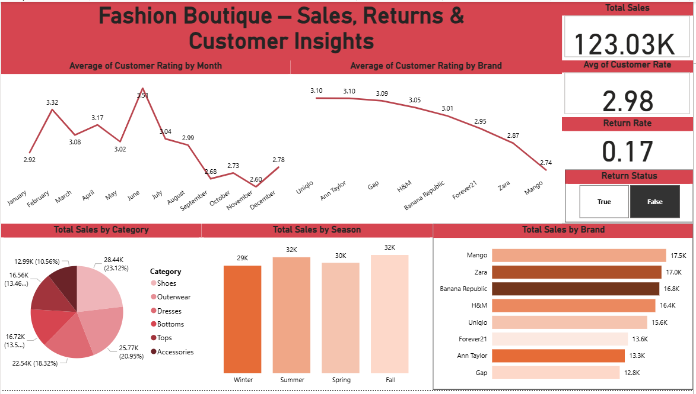

# 👗 Fashion Boutique — Sales, Returns & Customer Insights

## 📌 Project Overview
Proyek ini menganalisis data penjualan butik fashion yang mencakup atribut produk (kategori, brand, harga, diskon, stok), pengalaman pelanggan (customer rating), serta informasi operasional (retur dan alasannya).  

🎯 **Tujuan utama analisis**:  
- Memahami perilaku & tren pembelian pelanggan  
- Mengidentifikasi hubungan antara rating dan pengembalian produk  
- Menemukan pola musiman yang dapat dimanfaatkan untuk strategi bisnis  
- Memberikan rekomendasi berbasis data untuk meningkatkan kepuasan pelanggan & profitabilitas

📊 Metode yang digunakan:  
- **Exploratory Data Analysis (EDA)**  
- **Marketing Channel Analysis**  
- Visualisasi dashboard: **Power BI** & **Streamlit**  
- Eksplorasi data: **Google Colab**

---

## 🧭 Objectives & Questions
1. 📌 Kategori apa yang paling diminati?  
2. 🏷️ Brand apa yang paling diminati?  
3. ⭐ Bagaimana tren perubahan rata-rata customer rating per bulan?  
4. 🧥 Bagaimana perbandingan rata-rata rating antar brand?  
5. 🌤️ Musim mana yang memiliki total sales terbanyak?  
6. 🔁 Kategori apa yang paling laku tapi juga rawan retur?

---

## 📊 Key Metrics
- **Customer Rating**  
- **Brand**  
- **Category**  
- **Return Status**

---

## 🧹 Project Steps
1. **Data Understanding**  
   - Memahami struktur dataset & membuat objective questions.  
2. **Data Cleaning**  
   - Menangani missing values, duplicate data, dan outliers.  
3. **Exploratory Data Analysis (EDA)**  
   - Menjawab objective questions dengan key metrics.  
4. **Data Visualization**  
   - Dashboard interaktif dengan Power BI & Streamlit.

---

## 📈 Key Insights

- 💰 **Total penjualan** 2024–2025 mencapai **142,35K**  
- ⭐ **Rata-rata customer rating** = **2,98**  
- 🔁 **Persentase retur** = **15%**

### 📌 Category & Brand
- 👠 Kategori **Shoes** paling diminati (22,96%)  
- 🏷️ Brand dengan penjualan tertinggi:
  - Banana Republic (20,1K)
  - Zara (20K)
  - GAP (14,6K)
- ⭐ Brand dengan rating tertinggi: **Uniqlo** & **Ann Taylor** (3,08)  
- 📉 Brand dengan rating terendah: **Mango** (2,77)

### 📅 Seasonal & Rating Trend
- 🌞 Musim **Summer** memiliki total sales tertinggi (37K)  
- 📈 Puncak rating customer: **Juni (3,50)**  
- 📉 Rating terendah: **November (2,66)** & **September (2,69)**  
- 🧾 Penjualan **tanpa retur** tertinggi: Fall & Summer (32K)  
- 🔁 Penjualan **dengan retur** tertinggi: Winter (5,6K)

---

## 💡 Recommendations
1. 🎯 Fokuskan strategi pemasaran pada kategori **Shoes** & pakaian populer.  
2. 🧪 Analisis penyebab retur lebih lanjut, khususnya di musim Winter & Spring.  
3. 🚀 Manfaatkan periode Juni untuk kampanye besar saat rating customer tinggi.  
4. 🛍️ Perkuat kerja sama dengan brand unggulan seperti **Banana Republic**, **Zara**, dan **Uniqlo**.  
5. 📅 Gunakan pola musiman untuk perencanaan stok & promosi lebih efektif.

---

## 🧰 Tech Stack
- 🐍 **Python** (Pandas, Plotly, Streamlit) — data cleaning, EDA & dashboard  
- 📊 **Power BI** — dashboard interaktif  
- ☁️ **Google Colab** — eksplorasi & analisis awal  
- 📑 **Excel** — dataset mentah & hasil cleaning

---

## 📎 Resources
- 📄 **Raw Dataset** → `raw_fashion_data.xlsx`  
- 🧼 **Cleaned Dataset** → `cleaned_fashion_data.xlsx`  
- 📊 **Dashboard** → Power BI & Streamlit

---

## 👩‍💻 Author
**Arum Sekar Mawarni**  
📧 Email: [mawarniarumsekar99@gmail.com](mailto:mawarniarumsekar99@gmail.com)  
📱 Phone: 085727177335  
💼 LinkedIn: [LinkedIn Profile](#) *([https://www.linkedin.com/in/arumsekarmawarni/])*

---

## ⭐ Acknowledgement
Project ini dibuat sebagai bagian dari **Final Project — Full Stack Data Science Bootcamp (Dibimbing.id)**.  
Terima kasih kepada para mentor & teman-teman bootcamp atas bimbingan dan dukungannya 🙏

---

## 📌 Preview Dashboard
*(Tambahkan screenshot dashboard di bawah ini)*



---

## 🚀 How to Run Streamlit App
```bash
# 1️⃣ Install dependencies
pip install -r requirements.txt

# 2️⃣ Run the dashboard
streamlit run streamlit_app.py
